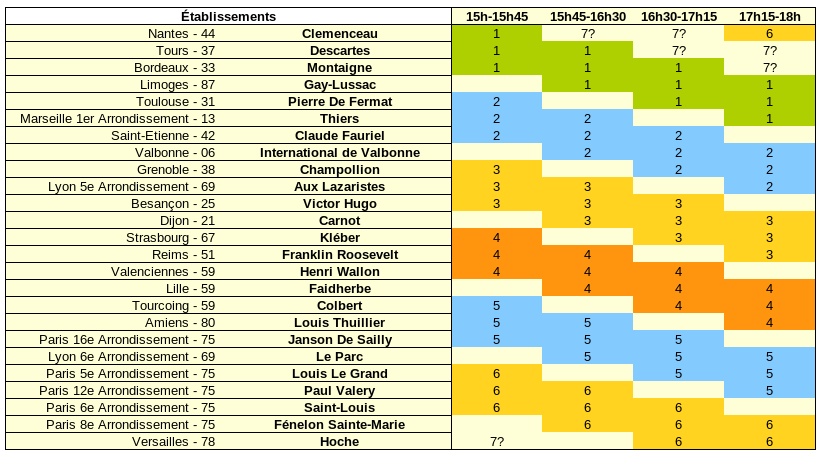
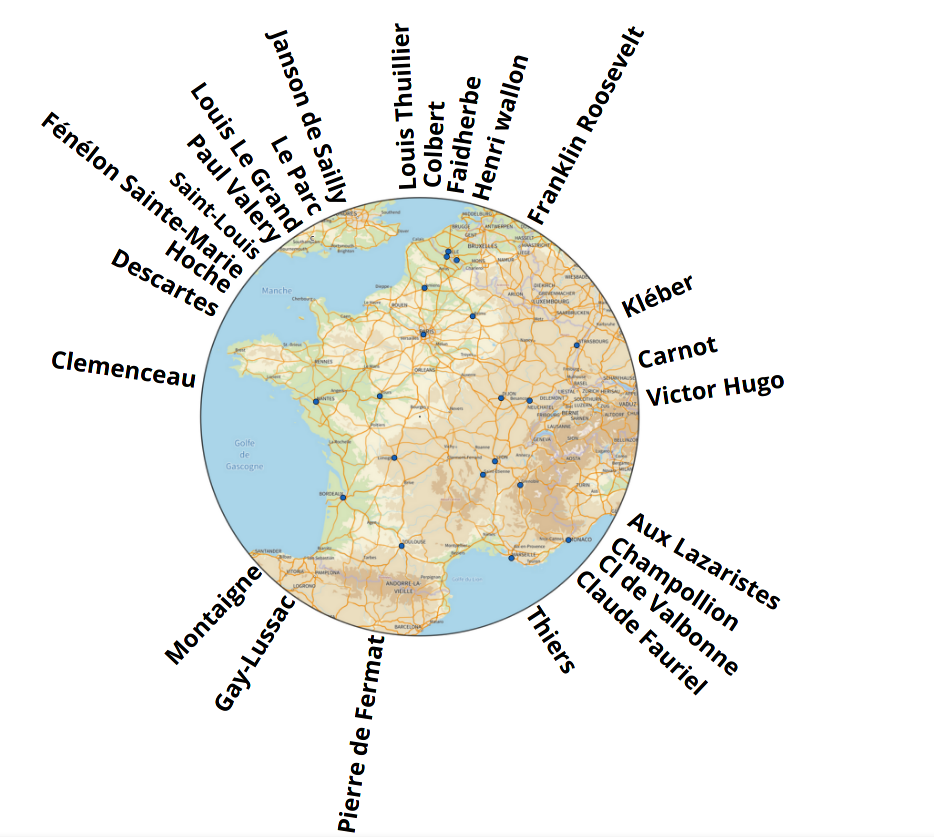

# Forum des étudiants en MP2I

## Présentation
Le forum des étudiants en MP2I se tiendra le samedi (12 ou 19) mars 2022 de 15h à 18h.

Venez découvrir la nouvelle classe préparatoire MP2I via différents stands rassemblant plusieurs établissements d'une même région.

Plus qu'une journée portes ouvertes, vous pourrez poser vos questions à plusieurs élèves de classes différentes afin d'avoir un aperçu plus complet de cette nouvelle filière !

## Organisation
### 14h50 : Cérémonie d'ouverture
Rendez-vous dans le salon général pour le lancement de ce forum 2022!
On vous présentera le fonctionnement des stands ainsi que les dernières nouvelles.

### 15h-18h : Rotation des stands
Voici la répartition des établissements selon les différents créneaux :

  
   

A vous de choisir le stand qui correspond à votre région et aux établissements qui correspondent à vos ambitions.

### 18h : Mot de fin
Cérémonie de clôture mais ce n'est qu'un au revoir ?

## Intervenants
Vous trouverez ci-dessous la liste des intervenants par établissements :