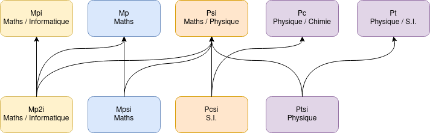

# Plan
 - La filière
	 -	Comparaison avec autres prépas (ok)
		 -	Dotation horaire (ok)
		 -	Programme (Math/Physique) (ok?)
		 -	La filière Info (a détailler)
		 -	Les spécialités de deuxième année (okà
	 -	En chiffres
		 -	Nombre de demandes / de place / de prépa
		 -	Comparaison des taux d'entrée avec la Mpsi
		 -	Nombre de places dans les écoles d'ingé ?
	 -	Carte des prépas en France

# La Filière
## Qu'est-ce que les classes préparatoires ?
La prépa est une formation théorique très complète pour préparer les concours de seconde année pour rejoindre une école d'ingénieur.
La formation est gratuite et elle est rattachée aux lycées, les effectifs ne dépassent pas 48 et les élèves sont très accompagnés par les professeurs.
Ils existent de nombreuses filières, pour mieux vous y retrouver voici leurs spécialités :

| Fillière |       Spécialité       | Math | Physique/Chimie | Chimie | Informatique |  SI  | LV1 | Français | Svt |
|:--------:|:----------------------:|:----:|:---------------:|:------:|:------------:|:----:|:---:|:--------:|:---:|
|   Mpsi   |      Mathématique      |  12  |        6        |    2   |      1.5     |   2  |  2  |     2    |  0  |
|   Mp2i   |      Informatique      |  12  |       6.5       |    0   |       4      |   2  |  2  |     2    |  0  |
|   Pcsi   |        Physique        |  10  |        8        |    4   |      1.5     |   4  |  2  |     2    |  0  |
|   Ptsi   | Sciences industrielles |   9  |        6        |    2   |      1.5     | 8h30 |  2  |     2    |  0  |
|   Bcpst  |        Biologie        |   8  |        4        |    3   |      1.5     |   0  |  2  |     2    |  8  |

## Le programme en Mp2i
Nous avons le même programme que les Mpsi en Mathématique et en Physique. La seule différence et que la chimie est remplacée par de l'informatique.

Concernant l'informatique, la programmation se fait en C et en Ocaml, on utilise quelques fois Python lors de Tp de physique.
Nous avons 2h de Tp par semaine ainsi que 2h de théorie qui nous servent à étudier les algorithmes de manière formelle.
Vous pouvez retrouver le programme complet d'informatique à [cette adresse](https://cache.media.education.gouv.fr/file/SPE1-MEN-MESRI-4-2-2021/64/6/spe777_annexe_1373646.pdf).

 Concernant les autres matières, la LV2 ainsi que le sport sont facultatifs.
 Mais la plupart des élèves garde une activité extra scolaire pour ne pas faire que des maths toute la journée !
 
## La spécialité en deuxième année
Dès le second semestre, nous devons choisir une option qui conditionnera notre filière en seconde année.
En Mp2i nous avons le choix entre Info pour aller en Mpi et S.I pour rejoindre la MP comme le font une grande partie des élèves en Mpsi.
Voici un récapitulatif des différentes filières en deuxième année :

Même si la plupart des élèves passent en Mpi, il est toujours possible de passer en Mp si la manière dont est abordé l'informatique ne vous convient pas.
Le passage en Psi est techniquement possible mais n'a pas été constaté.

## La MP2I en quelques chiffres
Comme la Mp2I vient d'ouvrir, il y a eu une grande demande pour cette filière avec peu de place disponible.
Les prépas les plus cotés sont donc plus difficiles à intégrer que la filière  Mpsi dans le même établissement.
À noter que la filière reste toujours accessible dans certains établissements, n'hésitez pas à faire de nombreux vœux pour vous retrouver dans une prépa à votre niveau.

Les chiffres cumulés :
- Nombre de places : 1048
- Nombre moyen de voeux formulés par établissement : 1471
- Nombre moyen de propositions d'admission envoyées : 243
- Rang moyen du dernier admis : 309
- Taux d'admission moyen : 24,63%

Lycées avec les plus bas taux d'admission :
- Lycée Louis Le Grand (Paris) : 4,21%
- Lycée Saint-Louis (Paris) : 6,67%
- Lycée Janson de Sailly (Paris) : 7,47%
    
Lycées avec les plus hauts taux d'admission :
- Lycée Charles Coeffin (Baie-Mahault) : 89,66%
- Lycée Victor (Besançon) : 51,33%
- Lycée Franklin Roosevelt (Reims) : 50,43%
